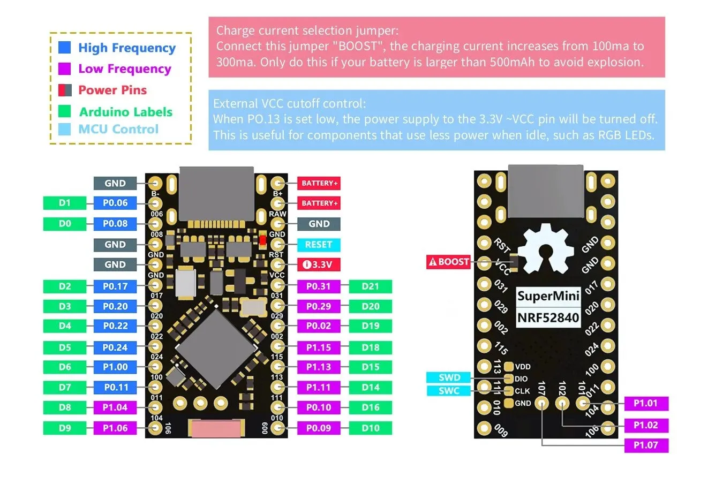
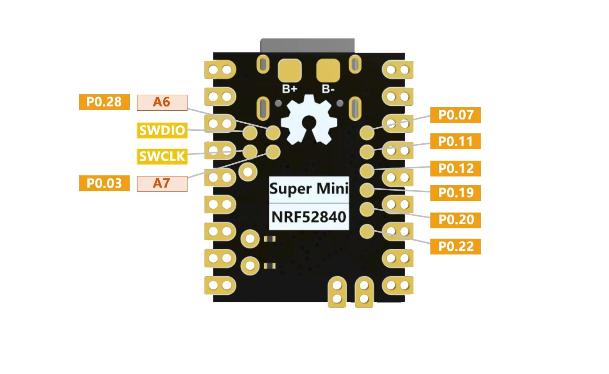
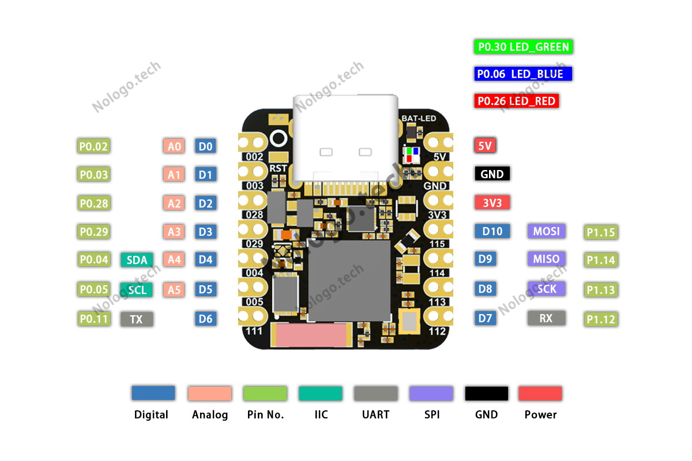
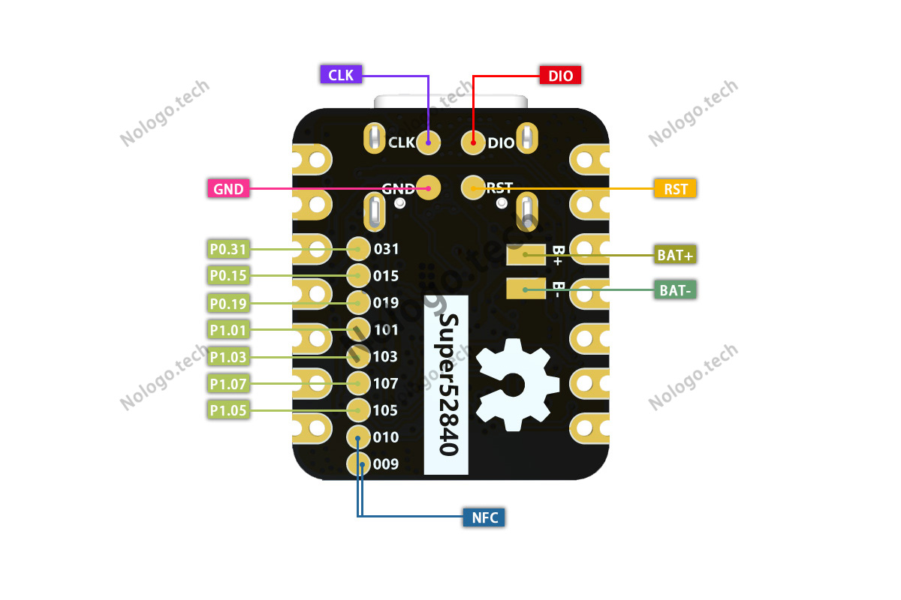

# nRF52840 보드 A·B·C

이 프로젝트에서는 저장된 핀아웃 파일에 따라 보드를 **A·B·C 세 종류**로 구분한다. 핀 배치가 다르므로 보드별 그림과 펌웨어 설정을 대조한다. `D번호`와 `P0.xx`·`P1.xx` GPIO 번호를 혼용하지 않는다.

| 구분 | 보드명 | 형태·호환성 |
|---|---|---|
| A | SuperMini NRF52840 | Pro Micro 형태, nice!nano v2 핀 배치 |
| B | SuperMini NRF52840 Zero | RP2040-Zero 형태, XIAO BLE 핀 배치와 비호환 |
| C | Super-nRF52840 | XIAO 형태, XIAO nRF52840 핀 배치·부트로더 사용 |

## A 보드 — Pro Micro형

Pro Micro 형태의 nRF52840 보드. USB-C, 세라믹 안테나, ESD 보호, Li-Po 충전 회로를 갖추며, nice!nano v2와 핀 배치가 같다.

### 핀아웃

| 핀 | 핵심 기능 |
|---|---|
| B+ / RAW | 배터리 양극 연결점 |
| B− / GND | 배터리 음극 / 공통 접지 |
| VCC | 외부 부품용 3.3V 출력 |
| P0.13 | VCC 제어. LOW이면 외부 전원 차단 |
| RST / SWD·SWC | 리셋 / 디버깅·펌웨어 기록 |

### 문제점

- **구형 보드 누설 전류:** VCC 차단 시 5.6kΩ 풀업 때문에 약 700µA 소비. 해당 저항 제거 또는 10MΩ 교체로 20µA 미만이 보고됐다. 2024년 4월 이후 개선됐지만 재고·생산분 확인이 필요하다.
- **배터리 측정 회로 오류:** 회로도에는 분압 출력이 ADC 핀 `P0.04`로 표시되지만, 실제 배선은 ADC를 지원하지 않는 `P0.24`다. 분압 부품도 미실장으로 보고되어, 부품 추가만으로 해결되지 않는다. 대안인 VDDH 측정도 USB 연결 시 전압이 상승해 배터리 잔량을 과대 표시한다. [회로 분석](https://github.com/sasodoma/nrf52840-promicro#schematic)
- **다이오드에 따른 절전 전류 차이:** `W5` 표시 부품은 BAT60B 쇼트키 다이오드여야 하지만, 일부 보드에서는 일반 실리콘 다이오드 특성이 측정됐다. 순방향 전압강하는 약 0.24V→0.7V, 역방향 누설 증가로 외부 VCC 차단 시 절전 전류는 약 4µA→60µA였다. 위 풀업 저항 문제와 별개다. [측정 사례](https://github.com/sasodoma/nrf52840-promicro#sleep-current-problems)
- **생산분 편차:** 32.768kHz 크리스털 불량과 MCU 고장 사례가 보고됐다.

### 특이점

- **충전 전류:** 기본 100mA, 뒷면 BOOST 점퍼 연결 시 300mA. 배터리의 허용 충전 전류를 확인한다.
- **LED 색상:** 빨강은 사용자/Bluetooth 표시, 파랑은 충전 표시로 nice!nano와 반대다.
- **펌웨어:** ZMK에서는 `nice_nano_v2` 설정을 사용한다. 이 호환성이 Meshtastic의 핀 설정까지 보장하지는 않는다.

## B 보드 — SuperMini NRF52840 Zero

RP2040-Zero 형태의 nRF52840 보드. 판매명은 SuperMini NRF52840으로도 표기되며, Wiki의 Zero 명칭은 잠정 구분이다. **XIAO BLE와 핀 배치가 호환되지 않는다.** [Wiki — Zero](https://github.com/joric/nrfmicro/wiki/Alternatives#supermini-nrf52840-zero)

### 핀아웃

| 앞면 | 뒷면 |
|---|---|
|  |  |

| 기능 | 그림 기준 핀 |
|---|---|
| UART | TX=`P1.03`, RX=`P1.10` |
| I²C | SDA=`P0.31`(A4), SCL=`P0.02`(A5) |
| SPI 클럭 | SCK=`P0.13`(D13) |
| 전원 | 앞면 5V·3V3·GND, 뒷면 B+·B− |
| 디버깅·확장 | 뒷면 SWDIO·SWCLK 및 추가 GPIO/ADC 패드 |

### 문제점·특이점

- **LED 핀 공유:** 그림에서 내장 LED와 D13/SCK가 모두 `P0.13`이다. SPI 사용 시 연결된 LED 회로를 확인한다.
- **추가 ADC:** 뒷면 A6=`P0.28`, A7=`P0.03` 패드가 있다.
- **검증 상태:** Wiki 작성자는 미시험으로 명시했다. 해당 항목에는 충전 전류·전원 차단·누설 전류 측정값이 없다.

## C 보드 — Super-nRF52840

XIAO 형태의 DIY 보드로, Wiki에서는 MINI nRF52840과 같은 보드로 소개한다. XIAO nRF52840 핀 배치와 부트로더를 사용하며, 별도 GitHub 저장소가 있다. [Wiki — Super-nRF52840](https://github.com/joric/nrfmicro/wiki/Alternatives#super-nrf52840)

### 핀아웃

| 앞면 | 뒷면 |
|---|---|
|  |  |

| 기능 | 그림 기준 핀 |
|---|---|
| I²C | SDA=`P0.04`(D4), SCL=`P0.05`(D5) |
| SPI | MOSI=`P1.15`(D10), MISO=`P1.14`(D9), SCK=`P1.13`(D8) |
| UART | RX=`P1.12`(D7), TX=D6(아래 표기 불일치 확인) |
| 전원 | 앞면 5V·3V3·GND, 뒷면 BAT+·BAT− |
| 디버깅·확장 | 뒷면 CLK·DIO·RST, 추가 GPIO 및 NFC 패드 |

### 문제점·특이점

- **배터리 극성 표기:** Wiki의 MINI nRF52840 항목에는 2025년 봄 생산분의 배터리 실크 오류와 9월 생산분 수정이 보고됐다. 저장된 C 뒷면 그림도 위쪽 패드가 B+로 표시되어 있으므로, 배터리 연결 전 실물 극성을 확인한다. [극성 문제](https://github.com/joric/nrfmicro/wiki/Alternatives#mini-nrf52840)
- **TX 표기 불일치:** 앞면 그림의 D6/TX 설명은 `P0.11`이지만 보드 실크는 `111`이다. `P1.11`인지 회로도 또는 실물로 확인한 뒤 배선한다.
- **RGB LED:** 초록=`P0.30`, 파랑=`P0.06`, 빨강=`P0.26`으로 표시되어 있다.
- **확장 핀:** XIAO 대비 뒷면 GPIO 7개(`P0.31`, `P0.15`, `P0.19`, `P1.01`, `P1.03`, `P1.07`, `P1.05`)가 추가된다. NFC용 `P0.09`·`P0.10`도 노출된다.
- **메모리·입출력:** 외부 2MB 메모리, 디지털/PWM 11개, 아날로그 입력 6개를 제공한다. [제조사 설명](https://github.com/NologoTech/Super-nRF52840)

## 참고 문서

- **A:** [Wiki — SuperMini NRF52840](https://github.com/joric/nrfmicro/wiki/Alternatives#supermini-nrf52840), [sasodoma — 회로 역설계·절전 전류 분석](https://github.com/sasodoma/nrf52840-promicro)
- **B:** [Wiki — SuperMini NRF52840 Zero](https://github.com/joric/nrfmicro/wiki/Alternatives#supermini-nrf52840-zero)
- **C:** [Wiki — Super-nRF52840](https://github.com/joric/nrfmicro/wiki/Alternatives#super-nrf52840), [NologoTech — Super-nRF52840](https://github.com/NologoTech/Super-nRF52840)

수치와 문제 사례는 각 문서에서 조사한 보드 기준이며 생산분에 따라 다르다.
