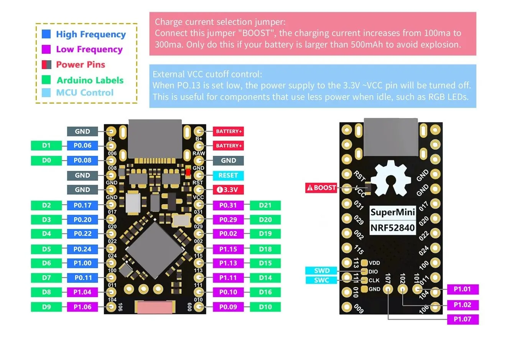
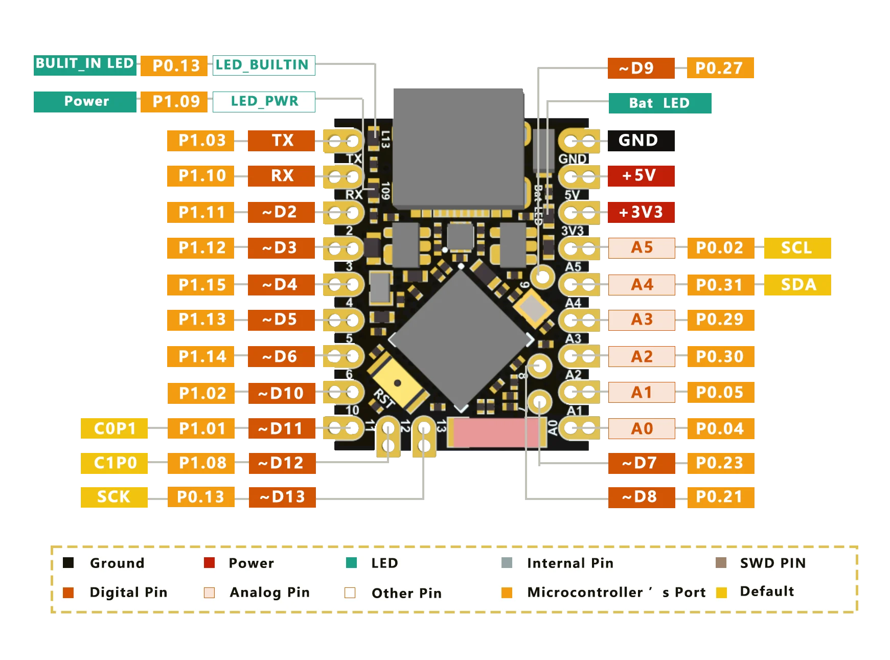
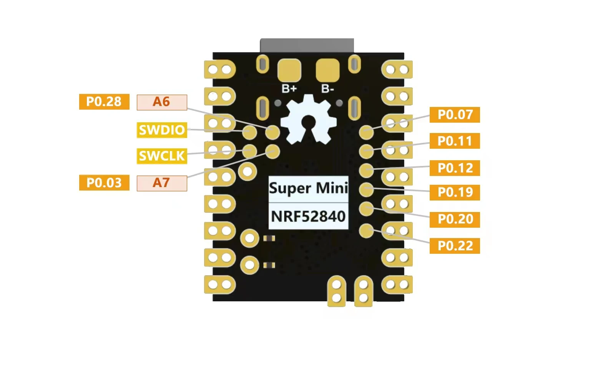
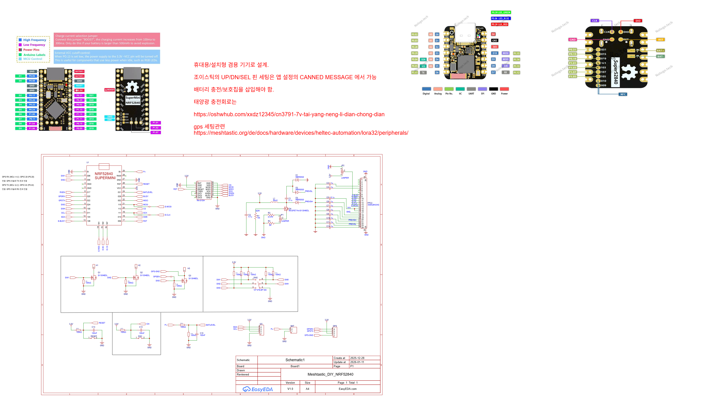

# Meshtastic DIY

Meshtastic DIY 기기를 용도별로 분류하고 관리하기 위한 프로젝트입니다.

## nRF52840 핀 리스트

| 핀 번호 | GPIO | Reserved | Addon |
|---------|------|----------|-------|
| 0 | GND | | |
| 1 | P0.06 | | |
| 2 | P0.08 | | |
| 3 | GND | | |
| 4 | GND | | |
| 5 | P0.17 | | |
| 6 | P0.20 | | |
| 7 | P0.22 | | |
| 8 | P0.24 | | |
| 9 | P1.00 | | EPD(BUSY) |
| 10 | P0.11 | SCL | |
| 11 | P1.04 | SDA | |
| 12 | P1.06 | | EPD(CS) |
| 13 | P1.01 | | EPD(RST) |
| 14 | P1.02 | | EPD(DC) |
| 15 | P1.03 | | |
| 16 | P0.09 | Lora Reset | |
| 17 | P0.10 | DIO1 | |
| 18 | P1.11 | SCK | EPD(CLK) |
| 19 | P1.13 | CS | |
| 20 | P1.15 | MOSI | EPD(DIN) |
| 21 | P0.02 | MISO | |
| 22 | P0.29 | BUSY | |
| 23 | P0.31 | | |
| 24 | VCC | | |
| 25 | RST | | |
| 26 | GND | | |
| 27 | RAW | | |
| 28 | B+ | | |

## Waveshare 전자잉크 드라이버 핀아웃

| 핀 | 기능 | 설명 | NRF52 |
|----|------|------|-------|
| VCC | 전원 | 3.3V | |
| GND | 접지 | Ground | |
| DIN | MOSI | SPI Data In | P1.15 |
| CLK | SCK | SPI Clock | P1.11 |
| CS | CS | Chip Select | P1.06 |
| DC | DC | Data/Command | P1.02 |
| RST | Reset | Reset | P1.01 |
| BUSY | Busy | Busy Status | P1.00 |

## 테스트 보드 회로도

## 현재 테스트 기능

휴대형 / 거치형

휴대형 

 - 배터리 사용, 별도의 전원 스위치, 디스플레이, 조이스틱 스위치
  - 디스플레이 구분 : oled 혹은 전자잉크
  - 충전 관련 회로 필요. nrf52840 내장 회로를 사용할 것인지, 혹은 별도의 충전 회로를 구성할 것인지?
  - 내장 회로를 사용하는 것이 편할듯, 보호 회로는?
   - 전압 모니터링 필요

거치형 
- 배터리 사용, 충전 회로, 보호 회로 
 - 디스플레이 : 없거나, 있어도 oled 사용
 - 스위치 : 

 ## 분류 체계

### 휴대형 
이동 중 사용을 위한 경량 배터리 기반 디바이스

**필수 옵션:**
- 배터리
- 디스플레이 (OLED / 전자잉크)
- 스위치
- 내장형 안테나, 혹은 소형 외장 안테나

**기타 옵션:**
- GPS
- 솔라패널
 - 키보드
 - 진동 모터 혹은 피에조

 휴대형 모델 A
 배터리, 디스플레이, 스위치,

### 거치형 
실내에서 고정 위치에 배치하는 상시 전원 연결 디바이스

**필수 옵션:**
- 디스플레이 (OLED / 전자잉크)

**기타 옵션:**
- 솔라패널
- 배터리
- 대형 화면 (MUI 사용 LCD)
 - 키보드
- 진동 모터 혹은 피에조

 거치형 옵션 a
 대형 화면, 키보드?
 안테나는 라우터 경유할 수도 있으니 소형, 혹은 내장형

###  설치형 
옥외 또는 고정 설치를 위한 내구성 강화 디바이스

**필수 옵션:**
- 솔라패널
- 배터리
- 고이득 안테나

**기타 옵션:**
- 환경 센서

### 기타

### 솔라패널 병렬 사용시 주의사항
역전압 방지 다이오드 사용 필수:
- **BAT54S**: 3.7V ~ 6V / 100mA 이하
- **SS14**: 6V ~ 12V / 0.5A 이하

