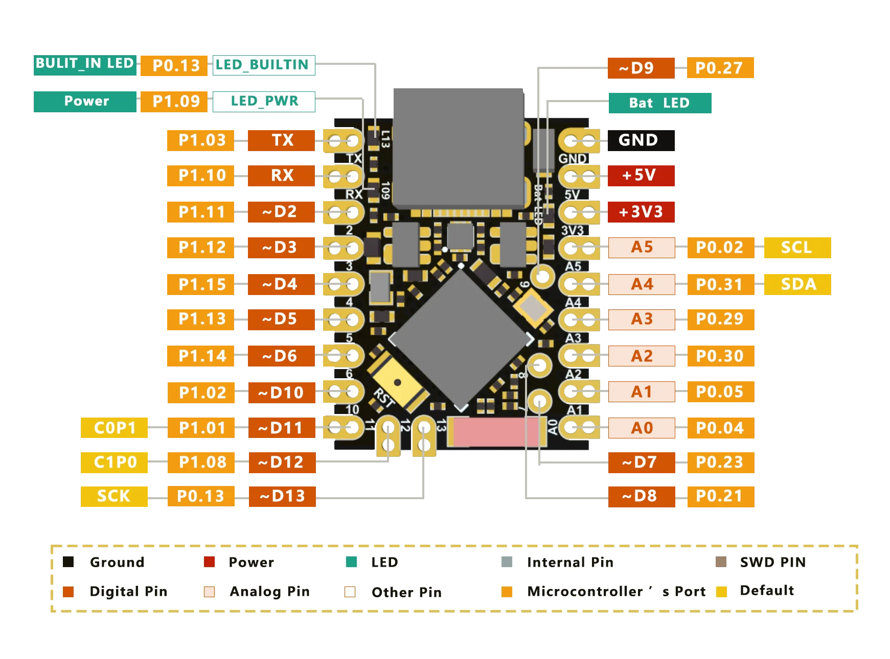
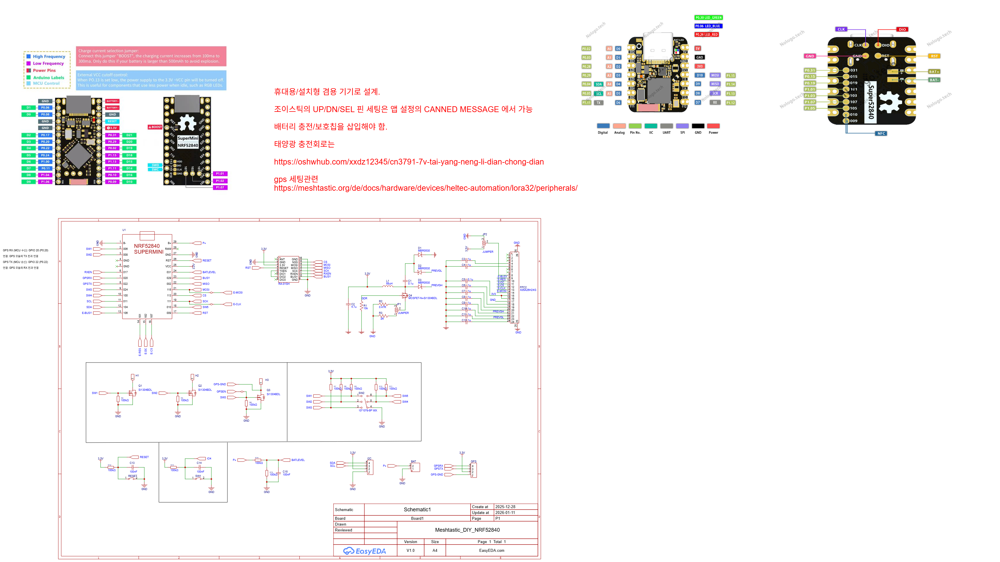

# Meshtastic DIY

Meshtastic DIY 기기를 용도별로 분류하고 관리하기 위한 프로젝트입니다.
휴대형 / 거치형 / 설치형 노드로 구분하며, 각 노드의 기능과 필요한 부품·회로를 기록하여 설계 및 제작에 참고합니다.

공통 기반: nRF52840 슈퍼미니 메인보드, 배터리는 18650 한 셀.

---

## 하드웨어

### 분류별 구조

#### 휴대형

- 배터리, 전원 스위치, 디스플레이(OLED/전자잉크/샤프 메모리 LCD 중 택일), 조이스틱 스위치 필수
- GPS·솔라패널·키보드·진동모터(피에조) 옵션. GPS는 중요하나 필수는 아님
- 충전은 nRF52840 내장 회로 사용 예정. 보호 회로 구성과 전압 모니터링 필요

#### 거치형

- 디스플레이(OLED/전자잉크) 필수. 배터리·솔라패널·대형 LCD(MUI)·키보드는 옵션
- 충전은 CN3791 MPPT 칩을 PCB에 직접 실장, 만충 전압은 피드백 저항으로 4.2V→3.8V 조정
- 보드 자체 충전 기능은 비활성화하여 CN3791과 출력 충돌 방지
- 센서는 I2C 온습도·기압, GPS 제외. OLED 점검용 I2C 커넥터와 확장 포트를 외부로 노출
- 안테나는 라우터 경유 가능성을 고려해 소형 또는 내장형 사용

#### 설치형

- 솔라패널, 배터리, 고이득 안테나 필수. 환경 센서는 옵션
- 옥외/고정 설치를 위한 내구성 강화 필요

### PCB 설계 주의점

- 솔라패널 병렬 사용 시 역전압 방지 다이오드 필수: BAT54S(3.7~6V/100mA 이하), SS14(6~12V/0.5A 이하)
- 배터리 전압 측정용 분압 회로의 ADC 입력 최대 전압 상한 확인 필요
- 보드 내장 충전 IC를 외부 MPPT(CN3791)와 함께 쓸 때 차단 방법 확인 필요

### 핀 정의

#### nRF52840 핀 리스트

| 핀 번호 | GPIO | Reserved | Addon |
|---------|------|----------|-------|
| 0 | GND | | |
| 1 | P0.06 | | |
| 2 | P0.08 | | |
| 3 | GND | | |
| 4 | GND | | |
| 5 | P0.17 | | |
| 6 | P0.20 | | |
| 7 | P0.22 | | |
| 8 | P0.24 | | |
| 9 | P1.00 | | EPD(BUSY) |
| 10 | P0.11 | SCL | |
| 11 | P1.04 | SDA | |
| 12 | P1.06 | | EPD(CS) |
| 13 | P1.01 | | EPD(RST) |
| 14 | P1.02 | | EPD(DC) |
| 15 | P1.03 | | |
| 16 | P0.09 | Lora Reset | |
| 17 | P0.10 | DIO1 | |
| 18 | P1.11 | SCK | EPD(CLK) |
| 19 | P1.13 | CS | |
| 20 | P1.15 | MOSI | EPD(DIN) |
| 21 | P0.02 | MISO | |
| 22 | P0.29 | BUSY | |
| 23 | P0.31 | | |
| 24 | VCC | | |
| 25 | RST | | |
| 26 | GND | | |
| 27 | RAW | | |
| 28 | B+ | | |

https://github.com/joric/nrfmicro/wiki/Alternatives#supermini-nrf52840l
를 참조하여 구버전 제품의 vcc 풀업저항을 제거하거나 10m 로 교체할것. 

#### Waveshare 전자잉크 드라이버 핀아웃

| 핀 | 기능 | 설명 | NRF52 |
|----|------|------|-------|
| VCC | 전원 | 3.3V | |
| GND | 접지 | Ground | |
| DIN | MOSI | SPI Data In | P1.15 |
| CLK | SCK | SPI Clock | P1.11 |
| CS | CS | Chip Select | P1.06 |
| DC | DC | Data/Command | P1.02 |
| RST | Reset | Reset | P1.01 |
| BUSY | Busy | Busy Status | P1.00 |

### 테스트 보드 회로도

---

## 소프트웨어

### 노드 설정 (펌웨어/앱)

- 거치형은 역할을 라우터로 설정, 좌표는 고정 수동 입력
- 텔레메트리 주기는 초기에 짧게, 이후 길게 조정
- 채널·주파수 대역 설정 필요

### 전원 관리

- 휴대형은 완전 전원 차단 또는 절전 모드 진입 방식 미정, 전력 소모 최소화가 핵심 과제

### 한글 입력 키보드 (휴대형 옵션)

- 상용 키보드 대신 직접 PCB 설계 및 펌웨어 작성, 목표는 한글 입력 구현
- 과제는 자모 조합 로직과 한글 폰트 렌더링
- 참고 작업: 냐씨안 CJK 포크, 쿠로안지 InkHUD 일본어 지원, InkHUD2
- 전자잉크 경로를 택할 경우 InkHUD 계열 폰트 교체가 가장 빠른 구현 방법

### 확인 필요 항목

- 원격 펌웨어 업데이트 방법
- 3.8V 충전 제한 시 흐린 날 지속 시간 계산
